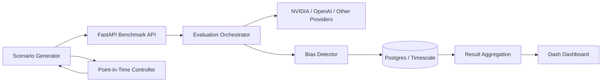
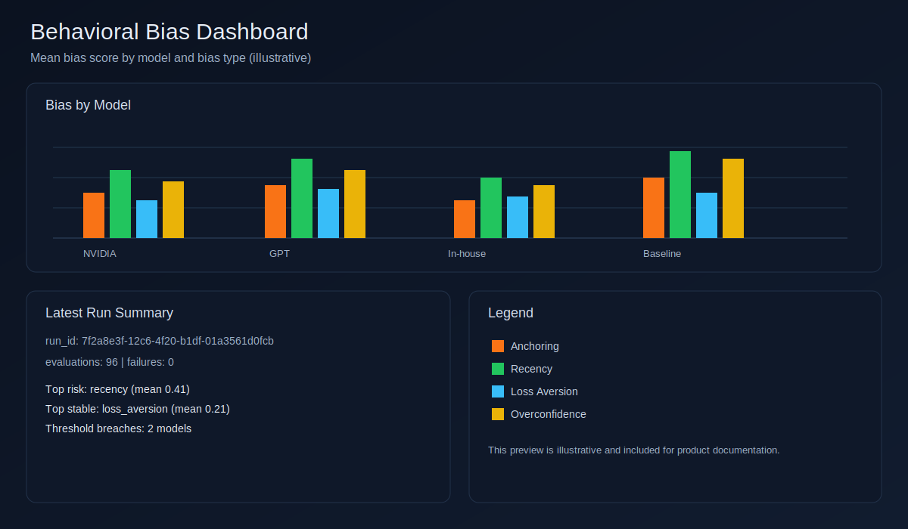

# Behavioral Bias Detection System for LLM Financial Agents

Systematic benchmark platform for detecting and reducing behavioral bias in LLM-driven financial recommendations before those models reach production.

## Who This Is For

- Head of AI / ML platform teams deploying decision-assistant models into trading or advisory workflows.
- Quant research teams evaluating model behavior under market stress and narrative shifts.
- Risk and compliance teams that need repeatable model-governance evidence.
- Product owners comparing external models (NVIDIA/OpenAI) against internal or gateway-routed models.

## Outcomes

- Reduce biased recommendations by identifying where models overreact (recency), anchor, or overstate confidence.
- Compare models with a common bias scorecard and scenario set.
- Generate auditable benchmark runs (`run_id`) for model risk reviews.
- Enforce point-in-time scenario integrity to avoid look-ahead leakage.

## Key Use Cases

- Model procurement: compare `NVIDIA vs GPT vs in-house gateway` on anchoring and loss-aversion tests.
- Pre-release safety gate: block deployment if overconfidence bias exceeds threshold.
- Continuous monitoring: run weekly benchmark jobs and trend bias by model version.
- Incident review: reproduce a run and show exact scenario context and timestamped prompts.

## What It Includes

- Bias scenario generator (anchoring, recency, loss aversion, overconfidence)
- NVIDIA-first LLM evaluation runner (with optional extra providers)
- Bias detection and scoring engine
- FastAPI service for benchmark orchestration and results
- Timescale/Postgres persistence
- Dash reporting dashboard
- Point-in-time validation guardrail for scenario timestamps

## Architecture

See full diagram and flow notes in [`docs/architecture.md`](docs/architecture.md).



## Dashboard Preview

Illustrative dashboard view:



## End-to-End Example

Use the included runner to seed scenarios, execute a benchmark, and print aggregate bias scores.

```bash
python examples/end_to_end_benchmark.py \
  --host http://localhost:8000 \
  --scenario-count 8 \
  --agent-spec nvidia:meta/llama-3.1-70b-instruct
```

To compare multiple models:

```bash
python examples/end_to_end_benchmark.py \
  --agent-spec nvidia:meta/llama-3.1-70b-instruct \
  --agent-spec openai:gpt-4o
```

To include an in-house OpenAI-compatible gateway model, create an agent with `config.base_url`:

```bash
curl -X POST http://localhost:8000/api/v1/agents \
  -H "Content-Type: application/json" \
  -d '{
    "provider": "openai",
    "model_name": "my-inhouse-model",
    "temperature": 0.7,
    "max_tokens": 1000,
    "config": {
      "base_url": "https://your-gateway.example.com/v1",
      "api_key_env": "INHOUSE_OPENAI_COMPAT_KEY"
    }
  }'
```

## Production Integration (Pseudocode)

```python
def release_gate(candidate_model: str) -> None:
    run_id = benchmark_api.run(
        agent_ids=[register(candidate_model)],
        scenario_ids=scenario_catalog.core_suite(),
    )

    scores = benchmark_api.results_by_model(run_id=run_id)
    thresholds = {
        "anchoring": 0.35,
        "recency": 0.30,
        "loss_aversion": 0.25,
        "overconfidence": 0.30,
    }

    for row in scores:
        if row["mean_bias_score"] > thresholds[row["bias_type"]]:
            raise DeploymentBlocked(
                f"Model failed {row['bias_type']} threshold in run {run_id}"
            )

    approve_deployment(model=candidate_model, evidence_run_id=run_id)
```

## Project Layout

```text
behavioral-bias-detector/
  docs/
    architecture.md
    images/
  examples/
    end_to_end_benchmark.py
  scripts/
  src/
    agents/
    api/
    config/
    core/
    dashboard/
    db/
    detectors/
    models/
    scenarios/
    utils/
```

## Quick Start

1. Copy env template:

```bash
cp .env.example .env
```

Then set at least:

```bash
NVIDIA_API_KEY=...
```

2. Start infrastructure:

```bash
docker compose up -d postgres redis
```

3. Install deps locally (optional if running in containers):

```bash
python -m venv .venv
source .venv/bin/activate
pip install -r requirements.txt
```

4. Initialize DB with baseline agents/scenarios:

```bash
python scripts/init_db.py
```

5. Run API:

```bash
uvicorn src.main:app --reload --port 8000
```

6. Run dashboard:

```bash
python -m src.dashboard.app
```

## API Endpoints

- `GET /health`
- `POST /api/v1/scenarios/generate`
- `GET /api/v1/scenarios`
- `POST /api/v1/agents`
- `GET /api/v1/agents`
- `POST /api/v1/benchmark/run`
- `GET /api/v1/results/by-model`
- `GET /api/v1/runs`

## Point-in-Time Data Policy

- Every scenario includes `as_of` timestamp in `historical_context`.
- `PointInTimeController` rejects future-dated scenario context.
- Scenario generation uses deterministic timestamps anchored to generation time.

## Notes

- Minimum key needed for this setup: `NVIDIA_API_KEY`.
- `NVIDIA_BASE_URL` defaults to `https://integrate.api.nvidia.com/v1`.
- Other provider keys are optional.
- For statistically meaningful results, run at least 30 evaluations per bias type and model.
- Anchoring bias is computed pairwise across high/low anchor twins per run and agent.
