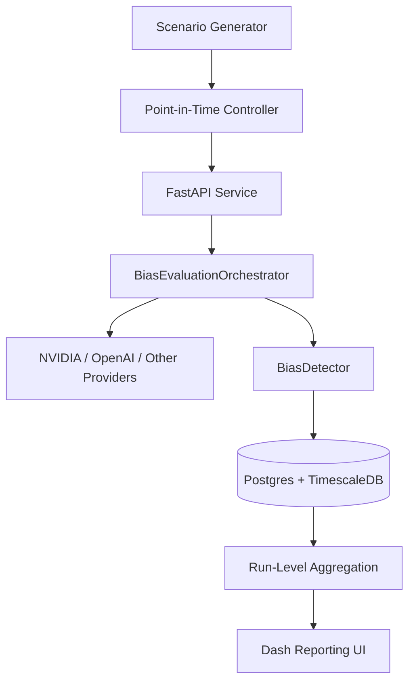

# Architecture

This repository is organized as a benchmark product: generate scenarios, run cross-model evaluations, compute bias metrics, and expose auditable results for dashboards and release gates.

## System Diagram

## Component Roles

- `src/scenarios/`: deterministic scenario templates and paired anchoring scenarios.
- `src/utils/pit_controller.py`: enforces no future context in scenario metadata.
- `src/agents/`: unified model client abstraction.
- `src/core/evaluator.py`: benchmark orchestration, concurrency, and persistence.
- `src/detectors/`: bias extraction and scoring logic.
- `src/api/`: benchmark execution and result endpoints.
- `src/dashboard/`: visual reporting layer.

## Data Flow

1. Generate or load scenarios with `as_of` timestamps.
2. Select agents and scenarios for a benchmark run.
3. Execute model calls and parse actions/confidence.
4. Score each response by bias type and store evaluations.
5. Aggregate per-run/per-model metrics for reporting and governance.

## Operational Notes

- Use run IDs (`run_id`) as immutable audit handles.
- Keep scenario versions stable across benchmark comparisons.
- Enforce thresholds in CI/CD before promoting new models.
